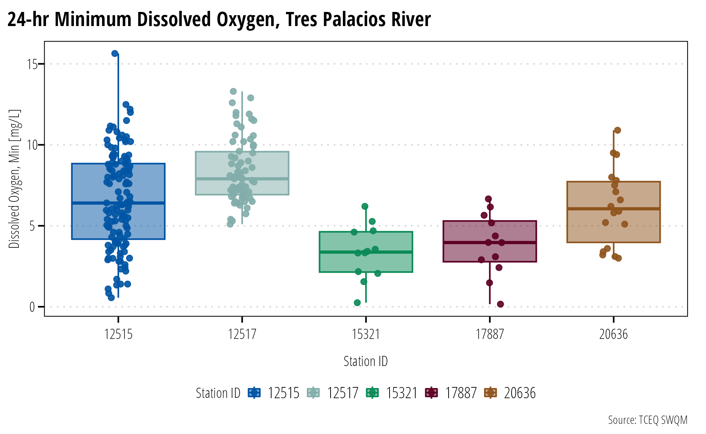

<!-- README.md is generated from README.Rmd. Please edit that file -->

# twriTemplates

<!-- badges: start -->

[](https://github.com/TxWRI/twriTemplates/actions)
[](https://codecov.io/gh/TxWRI/twriTemplates)
<!-- badges: end -->

This package provides:

-   Rmarkdown templates for work and pdf documents that follow
    recommended brand guidance
-   ggplot themes for common design styles between projects

## Installation

twriTemplates lives on Github, install using the remotes package:

``` r
install.packages("remotes")
remotes::install_github("TxWRI/twriTemplates")
```

## Usage

### Prerequisites

The Rmarkdown templates assume the required fonts are installed on your
system. The `Minion Pro` font among others are used by the various
templates and themes. We aren’t licensed to distribute some of the
fonts. Install all the fonts AgriLife provides at the [Marketing and
Communications branding
website](https://agrilife.tamu.edu/marketing-and-communications/resources/branding-agrilife/).

In order to use the pdf template, please install the tinytex package:

``` r
install.packages("tinytex")
tinytex::install_tinytex()
tinytex::is_tinytex()
```

Make sure the last function returns `TRUE`.

### Templates

Create a new Rmarkdown document, select “From Template”, and the TWRI
PDF template and TWRI doc template will be available in the list.


A new .Rmd file will open with example text and guidance in the
document.

### Theme

ggplot themes are provided for print and powerpoint presentation. The
main difference is that the fonts on the presentation styled theme are
scaled larger to facilitate reading from the back row in an auditorium.
There is also a function to add TWRI branding to your plots.

``` r
library(twriTemplates)
#> See https://github.com/TxWRI/twriTemplates for more details, use the Issues tab if you have questions.
library(ggplot2)
library(dplyr)
#> 
#> Attaching package: 'dplyr'
#> The following objects are masked from 'package:stats':
#> 
#>     filter, lag
#> The following objects are masked from 'package:base':
#> 
#>     intersect, setdiff, setequal, union

## report theme
p1 <- Dissolved_Oxygen %>%
  mutate(Station_ID = as.factor(Station_ID)) %>%
  ggplot(aes(Station_ID, 
             Min_DO, 
             fill = Station_ID, 
             color = Station_ID)) +
  geom_boxplot(alpha = 0.5) +
  geom_jitter(alpha = 0.9, width = 0.1, height = 0) +
  theme_TWRI_print() +
  scale_color_discrete_twri(name = "Station ID") +
  scale_fill_discrete_twri(name = "Station ID") +
  labs(x = "Station ID", 
       y = "Dissolved Oxygen, Min [mg/L]", 
       title = "24-hr Minimum Dissolved Oxygen, Tres Palacios River",
       caption = "Source: TCEQ SWQM")
p1
```



``` r
## presentation theme
## suggested export size is 10 inches wide by 7.5 inches tall.
p2 <- Dissolved_Oxygen %>%
  mutate(Station_ID = as.factor(Station_ID)) %>%
  ggplot(aes(x = Min_DO, 
             fill = Station_ID, 
             color = Station_ID)) +
  geom_histogram(alpha = 0.5) +
  facet_wrap(~Station_ID) +
  theme_TWRI_pres() +
  scale_color_discrete_twri(name = "Station ID") +
  scale_fill_discrete_twri(name = "Station ID") +
  labs(x = "Dissolved Oxygen, Min [mg/L]",
       y = "n measurements",
       title = "24-hr Minimum Dissolved Oxygen, Tres Palacios River",
       caption = "Source: TCEQ SWQM") +
  theme(legend.position = "none")
p2
#> `stat_bin()` using `bins = 30`. Pick better value with `binwidth`.
```


``` r
add_TWRI_logo(p2, scale = 0.2)
#> `stat_bin()` using `bins = 30`. Pick better value with `binwidth`.
```


